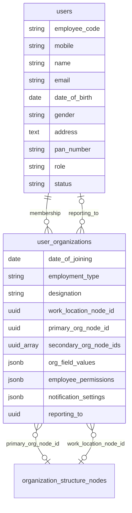

# Employee master structure

Aligned with the spreadsheet sections (personal → employment → org → permissions).

## Storage model

## Section mapping

| Spreadsheet section | Stored in |
|---------------------|-----------|
| 1. Personal details | `users` (+ mobile, name) |
| 2. Employment details | `user_organizations` + `users.status` |
| 3. Org unit mapping | `primary_org_node_id`, `secondary_org_node_ids`, `org_field_values.orgNodeByLevel` |
| 4. Module access | `employee_permissions.moduleAccess` |
| 5. Task permissions | `employee_permissions.taskRights` + `rights.edit` / `rights.delete` |
| 6. Document permissions | `employee_permissions.documentRights` (+ delete via `rights.delete`) |

Onboarded users are always `users.role = employee` (only org admins use the Employees screen).

Legacy JSON fields (`workflowRoles`, unused `rights.*`, `notification_settings`) are still stored with defaults on save but are not shown in the admin form.

## UI

Admin → **Employees** → Add/Edit opens collapsible sections (`EmployeeMasterFormSections.tsx`).

## Migration

Run: `20260521120000_employee-master-profile.sql`

## Enforcement

`employee_permissions` is enforced on task/document/messaging/dashboard APIs, employee web routes (`useEmployeePermissions`), and mobile (`useEmployeePermissions.js`, filtered tabs, FAB).

## Future

- Dedicated `employee_audit_logs` table
- Bulk parser columns for all new Excel headers
- Wire `notification_settings` into notification delivery preferences
